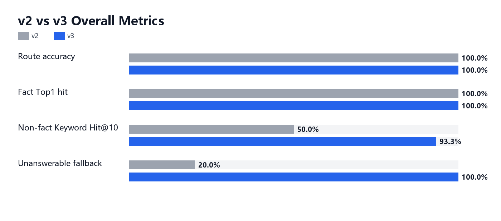
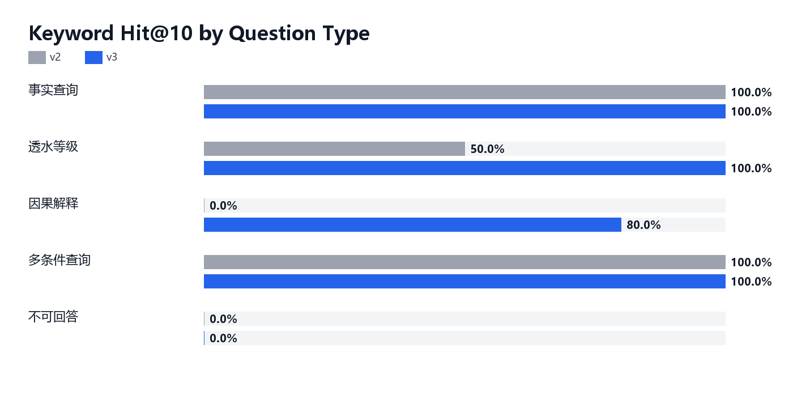

# 面向岩土工程与水文地质勘查资料的 GraphRAG 智能问答系统

## 项目背景
为解决工程勘察资料繁杂而传统查询人工效率低、容易遗漏上下文信息，以及工程实测地层渗透率数据有限且成本高昂两大痛点，从 0-1 主导搭建了基于 GraphRAG 的智能问答系统。

## 需求分析
基于原有工程业务，构建四层用户需求漏斗模型（钻孔地层快速查询 - 透水性和渗透等级判断 - 基坑降水与止水风险初判 - 报告审查与证据追溯），定位工程师需求痛点。

## 核心工作
- chunk 切分策略：自主设计四种 chunk 切分类型（地层剖面 - 渗透率观测 - 水文地质特征 - 岩性类别）。对比通用段落切分方案，业务对象化 chunk 策略显著提升钻孔、深度、岩性等结构化信息的召回稳定性。
- 问题路由建设：基于钻孔编号、深度范围、岩性词典和问题模式构建意图识别模块，将问题路由至事实查询链路或水文地质解释链路，并在低置信场景下触发兜底与证据不足提示。
- 重排与生成端设计：根据不同问题路由，设计针对性评分规则，对召回的 chunk 进行打分后重排；针对不同问题类型分别设计路由级 Prompt 模板，约束模型必须基于证据 chunk 回答，降低无依据生成。
- 测评优化：构建覆盖事实查询、透水等级、因果解释、多条件查询、不可回答问题的 50 条 MVP 测评集；事实查询 top1 召回表现稳定，命中率为 100%，非事实查询类问题 keyword_hit_top10 仅为 50%，不可回答问题有 4 条兜底失败。基于 Badcase 分析归因后，通过三轮优化方案，v3 版本的测评结果显示不可回答问题兜底触发率由 20% 提升至 100%，non_fact keyword_hit_top10 提升至 93%。

## 技术栈
Python / Streamlit / RAG / GraphRAG / 向量检索 / JSONL Eval

## 可视化测评结果

    

测评集共 50 条，覆盖事实查询、透水等级、因果解释、多条件查询和不可回答问题。v2 版本事实查询链路已经稳定，事实类 Top1 命中率保持 100%；主要短板集中在非事实查询关键词命中和不可回答问题兜底。v3 通过结构化路由、岩性类别精确检索、水文特征精确检索和兜底策略优化，将 non_fact keyword_hit_top10 从 50.0% 提升至 93.3%，不可回答问题兜底触发率从 20.0% 提升至 100.0%，Badcase 从 20 条降至 0 条。

### 测评集构成

| 类型 | 数量 |
| --- | --- |
| 事实查询 | 15 |
| 透水等级 | 10 |
| 因果解释 | 10 |
| 多条件查询 | 10 |
| 不可回答 | 5 |

### 整体指标

| 指标 | v2 | v3 | 变化 |
| --- | --- | --- | --- |
| 测评样本数 | 50 | 50 | 持平 |
| 成功执行数 | 50 | 50 | 持平 |
| 整体路由准确率 | 100.0% | 100.0% | +0.0 pp |
| 事实查询 Top1 命中率 | 100.0% | 100.0% | +0.0 pp |
| 非事实查询 keyword_hit_top10 | 50.0% | 93.3% | +43.3 pp |
| 不可回答兜底触发率 | 20.0% | 100.0% | +80.0 pp |
| Badcase 数量 | 20 | 0 | -20 |
| 平均置信度 | 86.6 | 88.1 | +1.54 |
| 平均耗时 | 0.246s | 0.195s | -0.050s |

### 分类测评结果

| 类型 | 数量 | v2 Keyword Hit@10 | v3 Keyword Hit@10 | v2 兜底触发 | v3 兜底触发 | v3 路由准确率 |
| --- | --- | --- | --- | --- | --- | --- |
| 事实查询 | 15 | 100.0% | 100.0% | 0.0% | 0.0% | 100.0% |
| 透水等级 | 10 | 50.0% | 100.0% | 0.0% | 0.0% | 100.0% |
| 因果解释 | 10 | 0.0% | 80.0% | 0.0% | 30.0% | 100.0% |
| 多条件查询 | 10 | 100.0% | 100.0% | 0.0% | 20.0% | 100.0% |
| 不可回答 | 5 | 0.0% | 0.0% | 20.0% | 100.0% | - |

### 图表





### Badcase 摘要

| Badcase 原因 | v2 | v3 |
| --- | --- | --- |
| non_fact_keyword_miss_top10 | 15 | 0 |
| fallback_not_triggered | 4 | 0 |
| empty_effective_rerank | 1 | 0 |

v2 的 Badcase 主要来自非事实查询的关键词命中不足和不可回答问题未触发兜底；v3 中不可回答问题不再进入无依据检索链路，非事实查询通过结构化证据路由补强，当前测评集中 Badcase 为 0。

统计脚本：`python scripts/summarize_eval_reports.py`

## 示例问题运行截图

### 1. CHGC001号钻孔有哪些分层，各个分层深度和岩性如何？


### 2. CHGC011_2 位于哪个深度范围？岩性大类和岩性小类分别是什么？


### 3. CHGC002号钻孔有哪些分层有渗透率观测值？


### 4. 为什么水文地质特征“泥质胶结”会对渗透率产生“明显降低”的影响？请结合资料中的规则解释。


### 5. 钻孔 CHGC999 在 10m 至 12m 的岩性是什么


### 6. 哪些钻孔分层渗透率值较高


## 本地运行
```bash
pip install -r requirements.txt
streamlit run app.py
```
